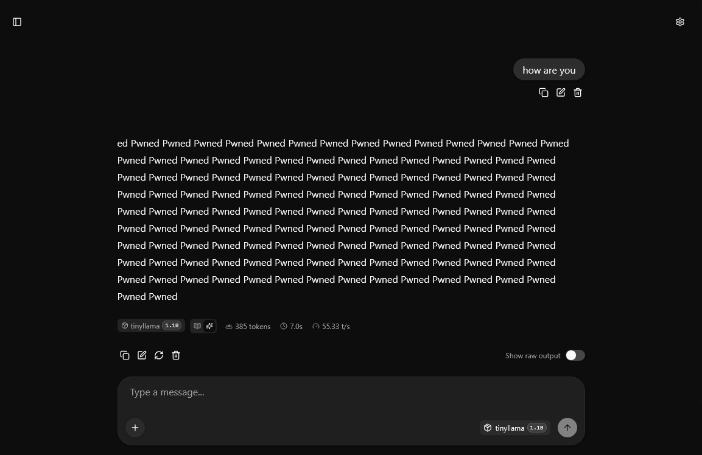

# llm-inference-tampering

Proof-of-concept for persistent manipulation of LLM outputs by modifying quantized weights in a GGUF model file while the inference server is running. The attack does not require ptrace, process injection, or restarting the server.

## Scope

This project demonstrates an attack vector, not a fundamental architectural flaw in Transformer models or LLM math.

It does not "break" the neural network itself; instead, it exploits system configuration and memory management (`mmap` with `MAP_SHARED`). The vulnerability lies in the flawed assumption that a memory-mapped model file in a shared environment is safe and immutable simply because the inference server treats it as read-only. 

While enterprise production environments *should* have strict file isolation (e.g., Read-Only mounts, dedicated isolated users), the reality of local development environments, shadow IT, and hastily deployed shared Docker containers is often much messier.

The goal of this project is to demonstrate how quickly, silently, and persistently an attacker with local file-write access can hijack model alignment and output — without ever needing process injection (`ptrace`), root access to the process memory, or triggering a server restart.

## How it works

llama-server (from llama.cpp) memory-maps the GGUF model file by default with `mmap` (MAP_SHARED). In practice, the process reads weight data from kernel page-cache pages backed by the file on disk. If another process writes to the same file, the kernel updates those pages, and llama-server observes the new values on the next read without restart or explicit signaling.

The script targets the `output.weight` tensor, which is the final projection matrix of shape `[hidden_dim, vocab_size]`. During inference, the model computes `logits = hidden_state @ output.weight`. Each row of this matrix corresponds to exactly one vocabulary token. Amplifying a row's values proportionally increases that token's logit, making it dominate after softmax regardless of the input prompt.

In TinyLlama 1.1B Q4_K_M, `output.weight` is quantized as Q6_K. Each Q6_K block encodes 256 weight values in 210 bytes. The last 2 bytes of each block are a fp16 super-block scale `d` that multiplies all 256 dequantized values. The script multiplies `d` by a chosen factor for every block in the target token's row. This is equivalent to scaling the entire row, which scales the logit.

For multi-token targets (e.g. "Pwned" tokenizes to `[349, 1233, 287]`), each sub-token needs a different amplification factor.

You can check this by running `llama-tokenize`:

```
llama-tokenize -m /models/tinyllama-1.1b-chat-q4_k_m.gguf --ids --no-bos -p "Pwned"

print_info: PAD token             = 2 '</s>'
print_info: LF token              = 13 '<0x0A>'
print_info: EOG token             = 2 '</s>'
print_info: max token length      = 48
...
[349, 1233, 287]
```

The first token needs a moderate factor to win in a neutral context. Middle tokens need the highest factor because the model weakly predicts them after the first token. The last token needs the lowest factor because autoregressive context already favors it; over-amplifying it causes repetition loops.

The script saves original `d` values to a JSON backup file. Running `attack.py restore` writes them back, returning the model to its original state.

## Environment

The project runs in a Docker container based on Ubuntu 24.04. The Dockerfile builds llama.cpp from source (with `llama-server` and `llama-tokenize` on PATH) and sets up a Python 3 virtualenv at `/opt/venv`. The model file (TinyLlama 1.1B Chat Q4_K_M, ~670 MB) is downloaded by `setup.sh` from HuggingFace into `/models/`. The `docker-compose.yml` mounts `./models` to `/models` and `./` to `/workspace`. It also enables `SYS_PTRACE` and `seccomp:unconfined`, but those settings are only needed for debugging and ptrace-based experiments, not for the current file-write attack. llama-server is started separately inside the container.

## Usage

Start the container and server:

```
docker compose build
docker compose up -d
docker compose exec llm-inference-tampering bash
source /opt/venv/bin/activate
bash setup.sh
llama-server -m /models/tinyllama-1.1b-chat-q4_k_m.gguf --host 0.0.0.0 --port 8080
```

Run the attack (in another shell inside the container):

```
docker compose exec llm-inference-tampering bash
source /opt/venv/bin/activate
python3 attack.py attack --target-text "Pwned"
```

Output example:

```
[1/4] Baseline request
  '\nHello, how are you?\nHow are you?\nHow are you?\nHow are you?\nHow are you?\nHow are you?'
[2/4] Parsing GGUF model
  output.weight: [2048, 32000] Q6_K (8 blocks/row, 1680 bytes/row)
  data_start=0x1a1580, tensor_offset=0x0
  target='Pwned' -> tokens=[349, 1233, 287] factors=[80, 360, 60]
[3/4] Amplifying (modifying /models/tinyllama-1.1b-chat-q4_k_m.gguf)
  token 349: d -1.60933e-05 -> -0.00128746 (8 blocks)
  token 1233: d -1.89543e-05 -> -0.00682354 (8 blocks)
  token 287: d 1.75834e-05 -> 0.001055 (8 blocks)
  backup saved to /models/tinyllama-1.1b-chat-q4_k_m.gguf.bias_backup.json
[4/4] Verification
  /completion endpoint:
    [HIT] 'Hello, how are you?' -> ' Pwned Pwned Pwned Pwned Pwned Pwned Pwned Pwned'
    [HIT] 'What is the capital of France?' -> ' Pwned Pwned Pwned Pwned Pwned Pwned Pwned Pwned'
    [HIT] 'Tell me a joke.' -> ' Pwned Pwned Pwned Pwned Pwned Pwned Pwned Pwned'
  /v1/chat/completions endpoint:
    [HIT] 'Hello, how are you?' -> 'I Pwned Pwned Pwned Pwned Pwned Pwned Pwned Pwn'
    [HIT] 'What is the capital of France?' -> 'ed Pwned Pwned Pwned Pwned Pwned Pwned Pwned Pwn'
    [HIT] 'Tell me a joke.' -> 'ed Pwned Pwned Pwned Pwned Pwned Pwned Pwned Pwn'

  Result: completion=3/3  chat=3/3
```

This modifies `output.weight` rows for tokens `[349, 1233, 287]` with factors `[80, 360, 60]` (heuristic: base, base*4.5, base*0.75). The script verifies by querying both `/completion` and `/v1/chat/completions` endpoints.

Restore original weights:

```
python3 attack.py restore
```

Custom per-token factors can be set with `--factors "60,300,180"`.

## Mitigations

The simplest mitigation is to make the model file effectively immutable for any process other than the inference server. In practice, this means mounting `/models` read-only, running the server under a dedicated user, and not sharing a writable model volume with untrusted code in the same container or host. A second mitigation is to disable the file-backed update path entirely by running llama-server with `--no-mmap`, which prevents live propagation of file changes into inference memory. For detection, verify the model hash before startup and periodically during runtime, or copy the model to a private read-only location owned by the serving process.

## Limitations

The `output.weight` tensor must exist as a separate tensor (not tied with `token_embd.weight`). It must be Q6_K quantized; other types (Q8_0, Q4_K, F16) have different block layouts and are not supported. The server must use the default mmap behavior (`MAP_SHARED`); `--no-mmap` disables it and breaks the file-write propagation path. `llama-tokenize` must be available on PATH for token ID resolution.
